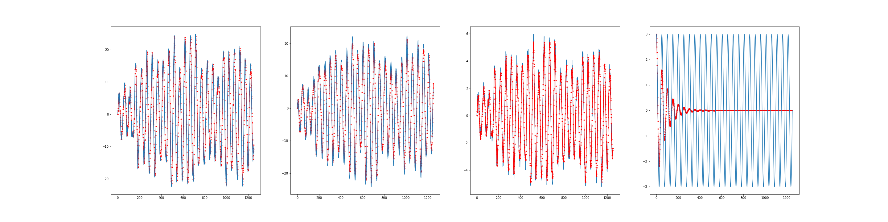
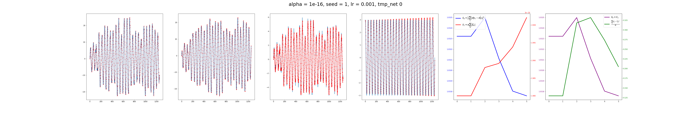

## Qmon-sindy

This is the repo for our project "Machine Learning Continuously-monitored systems".


### Prerequisites

Best thing is to install virtual environment in python>=3.8.  For example:
  ```python
  python3 -m venv install qenv
  ```
  then activate environment (you will save time if defining an [alias](https://www.tecmint.com/create-alias-in-linux/)) that executes this:

  ```sh
  source qenv/bin/activate
  ```
then upgrade pip
  ```python
  (qenv) pip3 install --upgrade pip
  ```
and finally install the required modules:
```python
(qenv) pip3 install -r requirements.txt
```

Additionally, we recommend running Hydrogen+Pulsar to test different settings and debug in a more efficient way. To set that up [this tutorial](https://pipegalera.com/posts/pulsar-hydrogen/). Remember to install ipykernel to use the virtual environment as the kernel in Hydrogen (step 4 of the tutorial).


<p align="right">(<a href="#readme-top">back to top</a>)</p>


<!-- GETTING STARTED -->
## Getting Started

In the following, we assume that the virtual environment is "prueba", and code is being run from `~/qmon-sindy/`
Let's plot some quantum trajectories. The `numerics/integration/external_forces.py` can be called  
```python
(prueba) mati@pop-os:~/qmon-sindy$ python3 numerics/integration/external_forces/sin.py
```

This code integrates using the (see itoSRI2 in [sdeint](https://pypi.org/project/sdeint/) for details) the quadratures $\vec{x} = \left(tr [\rho q], tr [p \rho]\right)$ of the quantum state $\rho$, and gets the measurement trace $d\vec{y}$ as
$$
\begin{align*}
d\vec{x} &= (A \vec{x}- \Sigma_t C^T) dt + C \Sigma_t C^T d\mathbb{y}_t + (0,f^{(a)}_t)^T dt \\
\frac{d\Sigma_t}{dt} &= A \Sigma_t + \Sigma_t A^T + D - \Sigma_t C C^T \Sigma_t\\
d\vec{y} &= C(\vec{x} + C^{-1} d\vec{W}_t)
\end{align*}
$$
Importantly, the presence of an external signal $f_t$ is assumed; such external signal is integrated using RK4 method. For example, if such a signal is a sinusoidal, we get
$$
\begin{align}
\frac{d\vec{f}}{dt} &=  \Big(\begin{matrix}0&\omega_f \\ -\omega_f & 0\end{matrix} \Big) \vec{f}  \\
\vec{f}_0 &= (f_0^{(a)}, f_0^{(b)})^T
\end{align}
$$

After the integration is done, the results are saved in a parent directory, automatically created by `get_def_path()`, defined in `numerics/utilities/misc.py`.

In `numerics/utilities/misc.py` module, the physical parameters of the sensor, as well as those associated with the external signal (force), are defined in `give_params()` function; note that we control the step_size in the integration (and the time-interval we integrate over) by the `periods` and `ppp` (points per period) variables, associated with the frequency of the mechanical oscillator. Also, note that default `mode="sin"` sets that the external signal is a sinusoidal, but the code is intended to define others easily.

The results of the integration are thus saved under a directory that specifies the simulation parameters. To run the simulation under a different choice of parameter values, one should modify `give_params()` function. Finally, such a function is also used to load the data, since it retrieves the parameters used in the simulation by default (by now the code is intended to be run with a fixed choice of physical parameters, and different ML-model configurations).

<p align="right">(<a href="#readme-top">back to top</a>)</p>

#### Plotting the results

One can analyze the trajectories obtained from different configurations of the sensor parameters (or external signals) in an interactive way either in a JupyerNotebook/Hydrogen. This can be done using the script `analysis/physical_parameters.py`, and iteratively modifying the parameters value defined in `get_def_path()` in `numerics/utilities/mics.py`. Note that each plot generated by the function `numerics.NN.misc.plot_integration` is stored in `analysis/physical_parameters/SPECIFIC_SETTING.png`.

```python
import numpy as np
from numerics.NN.misc import *

itraj, mode = 1, "sin"
params, exp_path = give_params(mode="sin")
params_sensor, params_force, [periods, ppp], [period, total_time, dt, times] = params

x = load_data(itraj=itraj, what="hidden_state.npy",mode=mode)
dy = load_data(itraj=itraj,what="dys.npy",mode=mode)
f = load_data(itraj=itraj, what="external_signal.npy",mode=mode)
freqs_signal, spectra_signal = power_spectra(dy[:,0], params)

fig = plot_integration(x,dy,f,freqs_signal, spectra_signal,params)
```

<p align="center">
  
</p>

<p align="right">(<a href="#readme-top">back to top</a>)</p>

#### The SINDy approach & NN module

Having the ground truth (e.g. the dynamics describing the signal), we want to play the following game: <i> how can we describe signal's dynamics using solely the measurement trace?</i> Aiming (possibly too) high, we have a custom Torch module that implements a Kalman Filter to track the hidden state, plus additionally integrating the external force using a pre-defined <i>trainable integration kernel</i>.
<p align="right">(<a href="#readme-top">back to top</a>)</p>

##### Trainable integration kernels

The approach we take is to have a dictionary of functions appearing in the (estimated) force dynamics, plus a (trainable) initial condition. In the repo, the models are defined according to the "mode" used to simulate the external signals.

In the following we inspect the `sin` mode. While the original signal is generated by integrating Eq(1), our machine-learning module keeps an <i>ansatz</i> for such an integration kernel. In this sense. our ML-modules consist on recurrent cells that implement a Kalman-update for the mechanical mode dynamics, plus the value of the external force obtained by integrating its dynamics via such an ansatz. For example, inspecting `NN.models.sin.in1_3.py`, we have

```python
def kernel(self,f):
    term1 = torch.squeeze(self.K1).matmul(f)
    term2 = torch.squeeze(self.K2).matmul(f**2)
    term3 = torch.squeeze(self.K3).matmul(f*torch.flip(f,[-1]))
    return term1 + term2 + term3
```
which replaces the dynamical law of the external force $f$ by:
$$
\begin{equation}
\frac{d\vec{f}}{dt} =  \Big(\begin{matrix}\xi_{00}&\xi_{01} \\ \xi_{02}& \xi_{03}\end{matrix} \Big) \Big(\begin{matrix}f_a\\f_b\end{matrix}\Big)+ \Big(\begin{matrix}\xi_{10}&\xi_{11} \\ \xi_{12}& \xi_{13}\end{matrix} \Big) \Big(\begin{matrix}f_a^2\\f_b^2\end{matrix}\Big) + \Big(\begin{matrix}\xi_{20}&\xi_{21} \\ \xi_{22}& \xi_{23}\end{matrix} \Big) \Big(\begin{matrix}f_a f_b\\f_b f_a\end{matrix}\Big)  \\
\end{equation}
$$
Note that we are asking the ML-module to learn the initial condition as well.

A single integration time-step is captured by the `forward()` method in this example found in `NN.models.sin.in1_3.py` (note that the `self.rk_step` calls the `self.kernel` method explained above under the hood, as it just implements an RK4 step inside the NN module using its trainable kernel:
```python
def forward(self, dy, state, f):
      """
      input_data is dy
      hidden_state is x: (<q>, <p>, Var[x], Var[p], Cov(q,p)})
      output dy_hat
      """
      x = state[:2]
      [vx,vp,cxp] = state[2:5]
      t = state[-1]
      cov = torch.tensor(data = [[vx,cxp],[cxp,vp]], dtype=torch.float32)

      xicov = cov.matmul(self.C.T)
      dx = (self.A - xicov.matmul(self.C)).matmul(x)*self.dt + xicov.matmul(dy)

      fnew = f + self.rk_step(f)

      dx += torch.squeeze(self.proj_F).matmul(fnew)*self.dt
      dcov = self.dt*(cov.matmul(self.A.T) + (self.A).matmul(cov) + self.D - (xicov.matmul(xicov.T)))
      ncov = cov+dcov

      nstate = torch.concatenate([(x + dx), torch.tensor([ncov[0,0],ncov[1,1],ncov[1,0]]), torch.tensor([t+self.dt])])
      dy_hat = self.C.matmul(x)*self.dt
      return nstate, dy_hat, fnew

```
The interesting thing of this approach is that parameters $\vec{\xi}$ can be trained, hopefully in such a way that the underlying force dynamics, for instance Eq(1), is reconstructed by properly tuning the parameters so to minimize a cost function, which we now turn to explain. We refer to the script `numerics/integration/external_forces/ansatz_sin.py` to inspect the effectiveness, expressiveness and difficulties of a given integration kernel ansatz.

<p align="right">(<a href="#readme-top">back to top</a>)</p>
##### Maximum likelihood training
Our trainable integration kernels are fit in such a way that the likelihood of getting the measurement trace d$\vec{y_t}$ given the kernel parameters $\vec{\xi}$ (plus initial condition) is maximized. Such a cost-function, `log_lik(dys, dys_hat)` (plus regularizations) is defined in `NN.losses`.

The whole training loop is defined in `NN.modes.sin.in1_3.py` (note that we split different ansatzes into different cases, since we want to cast increasingly more complex alphabets). To run such optimization simply execute

```sh
(prueba) mati@pop-os:~/qmon-sindy$ python3 numerics/NN/modes/sin/in1_3.py --printing 1 --tmp_net 0
```
The initial values of the parameters $\vec{\xi}$ (as well as the initial condition), can be assigned in a custom way via the `w0_net()` function, found in `NN.misc`. For example, in this case we have

```python
def w0_net(mode,id_NN,tmp_net):
    if mode == "sin":
        if id_NN=="in1_3":
            coffs = {}
            if tmp_net==0:
                gin,oin = -.1, 1.*0.99
                ep2, ep3, ep4, ep5 = [.5, .4, -.3, .2]
                initial_condition = np.array([3.,0])
                coffK2= 0.*np.array([-.1, .02, -.02, -.4])
            elif tmp_net == 1:
                (...)
            coffs["K1"] = np.array([gin, oin, -oin, gin])
            coffs["K2"] = coffK2
            coffs["K3"] = ep2*coffs["K2"]
```
The results of the optimization are stored at each gradient iteration are stored in a parent directory as defined by the `save_history()` function, found in `NN.misc`.
<p align="right">(<a href="#readme-top">back to top</a>)</p>

##### Loading the training results

Similar to the quantum trajectories visualization, we provide a module to interactively load the results of each ML experiment. A working example can be found in `analysis/sin/Lenovo/in1_3.py`, in which the loading and plotting functions defined in `numerics.NN.misc` are heavily used:

```python
import matplotlib.pyplot as plt
from numerics.NN.misc import *

itraj=1
mode="sin"
id_NN = "in1_3"
alpha, lr, tmp_net = 1e-16, 1e-3, 0

rrn, ixs_hat, idys_hat, ifs_hats, x, dys, f, exp_path = get_plot_data_NN(itraj=1, mode="sin",id_NN="in1_3")

fig1, fig2 = load_rnn_and_plot(rrn, ixs_hat, idys_hat, ifs_hats, x, dys, f, exp_path, itraj=1, alpha=alpha, lr=lr, tmp_net=tmp_net)
os.makedirs("readme_plots/",exist_ok=True)
fig1.savefig("readme_plots/fig1.png")
fig2.savefig("readme_plots/fig2.png")
```
This code depicts two results. In fig1 we aim to capture how accurate the knowledge of the system is according to the initial guess for the kernel dyamics, as defined via `tmp_net` variable:

<p align="center">

</p>

In this example, we see that even if the guess for the force is quite bad (since we added a non-zero damping), the tracked state of the mechanical-mode oscillator is still accurate, which is reflected in the $d\hat{y}_t$ variable, plotted with the red dots in the third column. This example indicates that this choice of parameters is quite unfortunate, since the sensitivity of the sensor to the presence of an external signal of a different nature is almost null.

In order to depict training, fig2 shows the predictions for the quadratures (along with the true values), and also the external force (fourth column). In col5 we plot the likelihood and in col6 we plot the difference between predicted external signal and ground truth one (MSE over time).
<p align="center">
  
  </p>
  <p align="right">(<a href="#readme-top">back to top</a>)</p>
